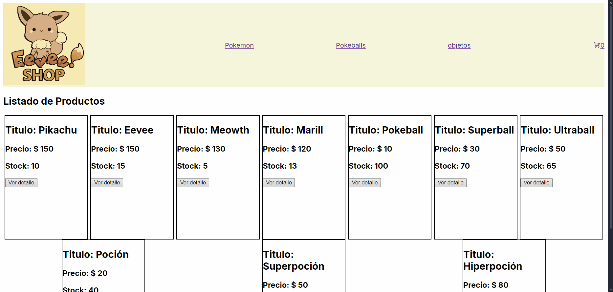

# Pokémon Store — React Shopping App

A Pokémon-themed store built with *React* and *Vite*. Users can browse Pokémon products, add them to a shopping cart and manage their purchases across multiple pages.

---

## Technologies

- *React* — UI library
- *Vite* — Build tool and dev server
- *JavaScript* — Core language
- *CSS* — Styling (in progress)

---

## Features

- ✅ Product listing page
- ✅ Shopping cart with item accumulation
- ✅ Multiple page navigation
- ✅ Add / remove products from cart
- 🔧 Styling improvements (in progress)
- 🔧 Deploy (pending)

---

## Preview

